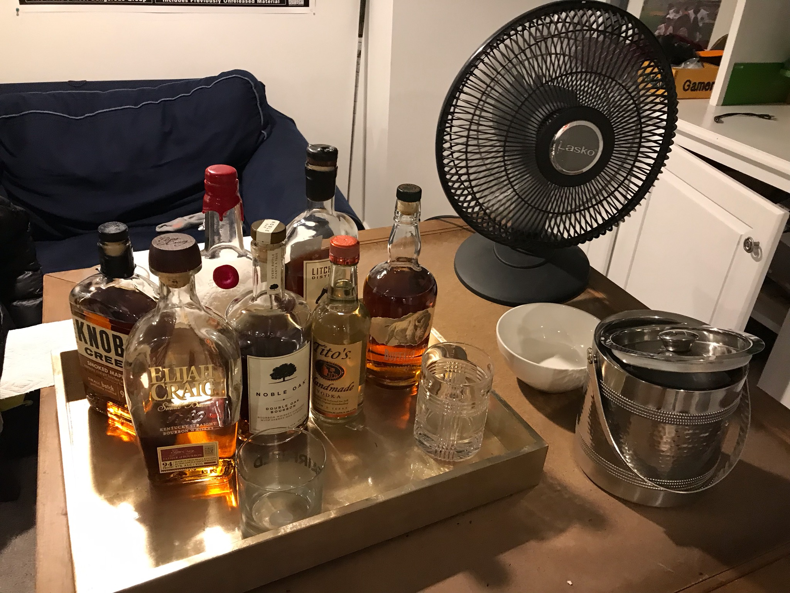
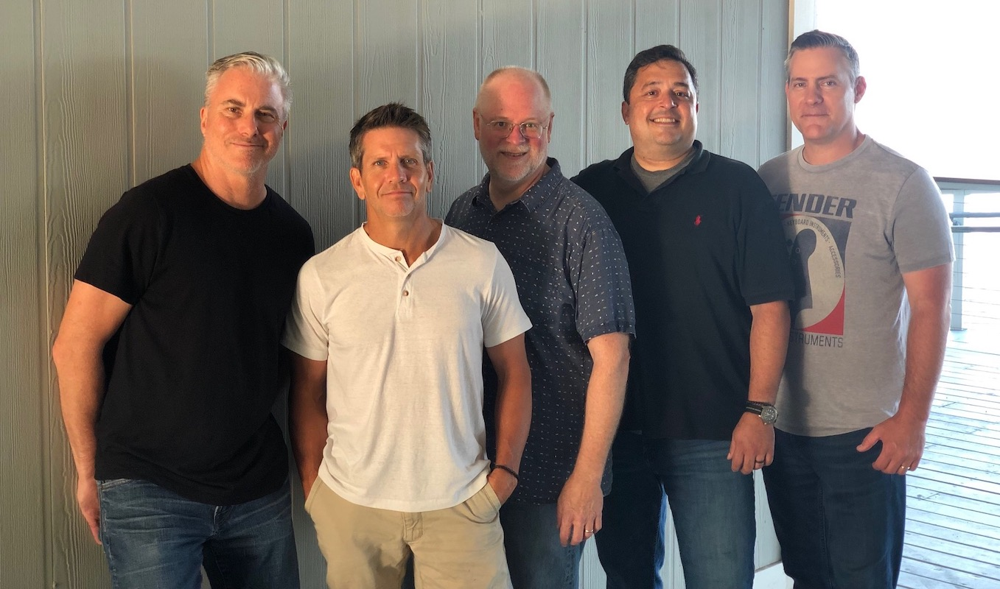

# About Ellis Island

  &times;
  
  

<table>
  <tr>
    <td style="padding-right: 3em;">
      Ellis Island is made up of musicians with diverse backgrounds and
      musical histories. Combined, they have more than a century of
      experience playing for audiences from upstate New York down to Alabama
      and Florida and across the ocean in London.
    </td>
    <td width="300">
      
      
Island Juice

    </td>
  </tr>
  <tr>
    <td colspan="2" style="text-align: center;">
       
      
      
L to R: Tim, Jeff, Jim, Alex, Nate

    </td>
  </tr>
</table>

## Tim Ellis

Vocals and electric and acoustic guitars (*and foot tambourine*).

## Nate Balogh

Electric and acoustic guitars and occasional bass.

## Alex Giannaras

Bass and vocals.

## Jeff Steele

Drums and percussion.

## Jim Menard

Keyboards and occasional bass (*and tambourine on one song, and they let
him sing some harmony that's not critical or needs to be in tune or
anything*).
