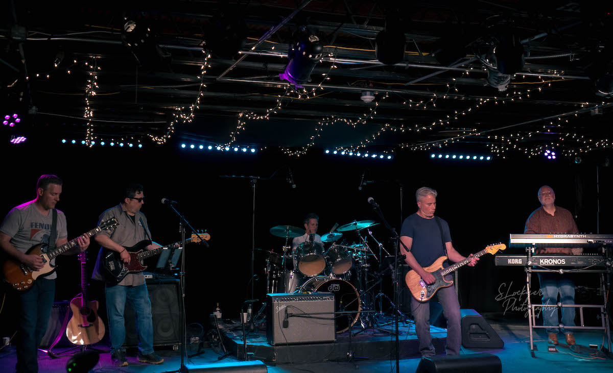
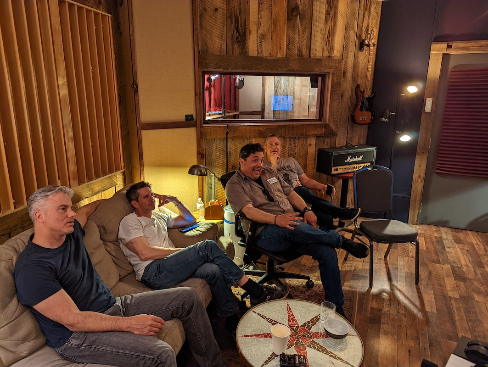
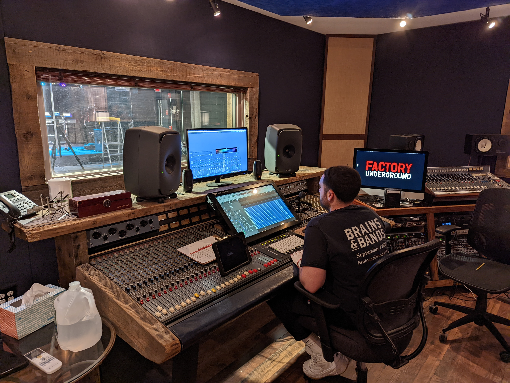

# Gallery

## Mystery Recording Session

In May of 2022, the band held a recording session at Factory Underground in
Norwalk for a special project that we'll announce soon!

  &times;
  
  

<table width="100%">
  <tr style="vertical-align: top;">
    <td colspan="2" width="100%" style="align: center; text-align: center;">
      
      
The band @ Factory Underground, May 2022

    </td>
  </tr>
  <tr style="vertical-align: top;">
    <td with="50%" style="align: center; text-align: center;">
      
      
Nate and Alex setting up their gear on stage

    </td>
    <td with="50%" style="align: center; text-align: center;">
      
      
Four of five band members listening to takes

    </td>
  </tr>
  <tr style="height: 4em;">
    <td>&nbsp;</td>
  </tr>
  <tr style="vertical-align: top;">
    <td with="50%" style="align: center; text-align: center;">
      
      
The mixing board and window into the stage area

    </td>
    <td with="50%" style="align: center; text-align: center;">
      &nbsp;
    </td>
  </tr>
</table>

