# Schedule

## Upcoming

* **February 25th, 2021** &ndash; *Private Event*, benefit concert for
  D'Valda and Sirico Dance and Music Centre.
  [Fairfield Theatre Company](https://fairfieldtheatre.org/) (FTC), Fairfield, CT.

* **March 11th, 2023** &ndash;
  *[Rach's Hope](https://www.rachshope.org/)* PJ Gala fundraiser,
  [Fairfield Theatre Company](https://fairfieldtheatre.org/) (FTC), Fairfield, CT.

## Past Gigs

### January 2023

* **January 13th, 2023** &ndash; *Park City Music Hall*, Bridgeport CT. Back
  so soon? Yes! Ellis Island is thrilled to be back at Park City. Come see
  the opening band Get Lit at 9pm and stick around, drink, and dance as we
  rock the house all night long!
  [Tickets](https://parkcitymusichall.com/event/ellis-island-get-lit/park-city-music-hall/bridgeport/)
  are $10, or $13 day of the show.

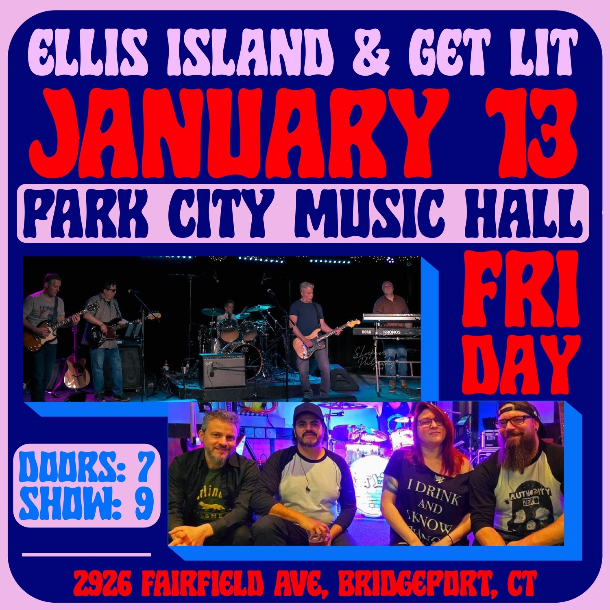

### December 2022

* **December 2nd** &ndash; We're opening for
  [The Amish Outlaws](https://amishoutlaws.com/) at *Park City Music Hall*,
  2926 Fairfield Ave, Bridgeport, from 9:00 - 10:15. Come see us then stick
  around for a fun, high-energy band that tours all up and down the East
  Coast.
  [Get your tickets here](https://www.etix.com/ticket/p/8676333/the-amish-outlaws-bridgeport-park-city-music-hall).
  Tickets are $21 in advance, $26 day of the show.

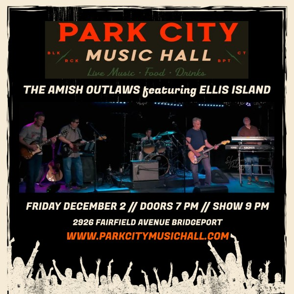

### October 2022

* **October 1st, 2022** &ndash; *Milford PorchFest*, Milford CT. 4-6pm at 61
  Melba Street. It's a prime location, right on the beach! The whole event
  runs from noon to 6pm.

* **October 22nd, 2022** &ndash; *Private Event*.

### September 2022

* **September 10th, 2022** &ndash; Look for Ellis Island at Stratfield
  Village Associations's *Lincoln Parkapalooza* fundraising event! We'll be
  on the main stage from 6:30-7:30, followed by The Tom Petty Project.
  Lincoln Park, 455 Jackman Ave, Fairfield, CT.

* **September 15th, 2022** &ndash; *Halloween Yacht Club* (10 Seaview Ave,
  Stamford) has bands outside all summer long on Thursday nights. See you on
  there on the 15th, 6:30 - 9:30.

### August 2022

* **August 4th, 2022** &ndash; *Private Event*, Penfield Pavilion,
  Fairfield, CT.

* **August 20th, 2022** &ndash; *Fairfield Sherman Green* (the Gazebo),
  6:30 - 8:00. Corner of Post Road (Route 1) and Reef Road.

* **August 25th, 2022** &ndash; Warde Baseball fundraiser at BRYAC, 3074
  Fairfield Avenue, Bridgeport, CT. 8-11pm. Your $20 donation goes to the
  team.

* **August 27th, 2022** &ndash; *Black Rock PorchFest* in Bridgeport, CT.
  We'll be at 49 Fayerweather Terrace from 5-6pm.

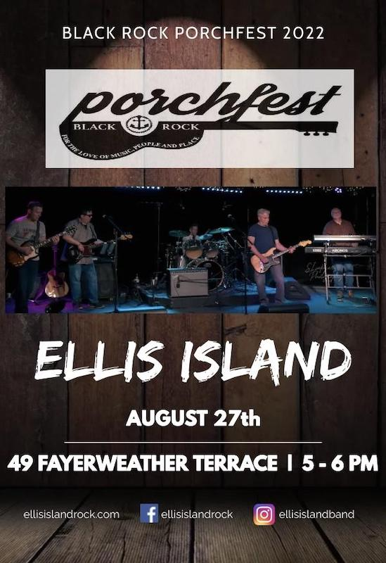

### May 2022

* **May 7th, 2022** &ndash; Ellis Island Acoustic (Tim and Jim) will be at
  the *Rach's Hope PJ Gala 2022*, Penfield Pavilion, Fairfield, CT from
  7:30 - 11:00. This is a charity event with food, auctions, and music. For
  more info see [Rach's Hope](https://www.rachshope.org/).

* **May 20th** &ndash; Ellis Island Acoustic (Tim and Jim) are at a Westport
  Church event.

* **May 21st, 2022** &ndash; *Brooklawn Country Club*'s "Kick Off for
  Summer" party. 500 Algonquin Rd, Fairfield, CT. It's outdoor fun time, so
  bring a chair or blanket if you like, and bring your dancin' shoes!

* **May 22nd, 2022** &ndash; *Fairfield Sherman Green* (the Gazebo),
  6:30 - 8:30. Corner of Post Road (Route 1) and Reef Road.

### March 2022

* **March 11th, 2022** &ndash; *The Shebeen of Black Rock*, 2652 Fairfield
  Ave, Bridgeport, CT. 8:00 PM --- an early start!

### December 2021

* **December 4th** &ndash; *Private Event* for the Stratford Village
  Association at The Discovery Museum in Bridgeport, CT.

* **December 10th** &ndash; Ellis Island Acoustic (Tim and Jim) are at the
  *Stamford Yacht Club*, 97 Ocean Dr W, Stamford, CT from 5:30 - 8:30. We'll
  be playing a mix of Christmas songs and our usual repertoire.

* **December 17th** &ndash; *The Shebeen of Black Rock*, 2652 Fairfield Ave,
  Bridgeport, CT. 8:30 PM.

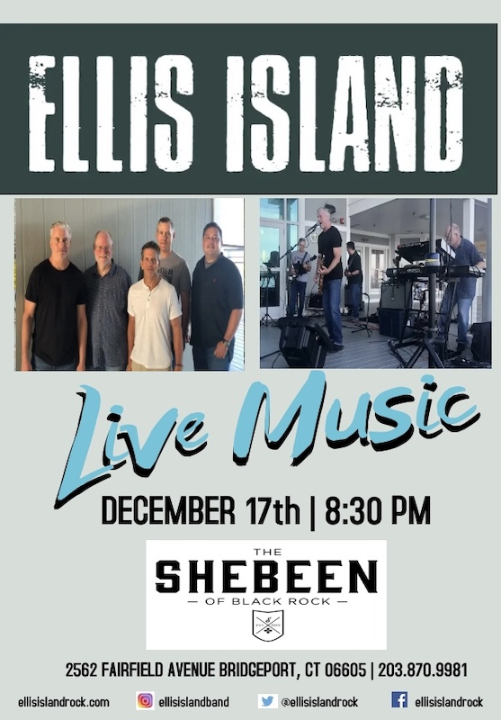

### October 2021

* **October 2nd** &ndash; Ellis Island Acoustic (Tim and Jim) are at *Rach's
  Hope "Walk the Extra Mile with Pa!"* at 4pm at the Ned Dimes Marina
  boathouse at Compo Beach in Westport, CT. See
  [https://rhwalk.givesmart.com](https://rhwalk.givesmart.com) for more
  info.

* **October 7th** &ndash; *Private Event* Ellis Island Acoustic (Tim and
  Jim) are at the Halloween Yacht Club in Stamford, CT from 7pm-10pm.

* **October 17th** &ndash; 5:00 - 8:00 at Cisco Brewers at The Village, 4
  Star Point in Stamford.

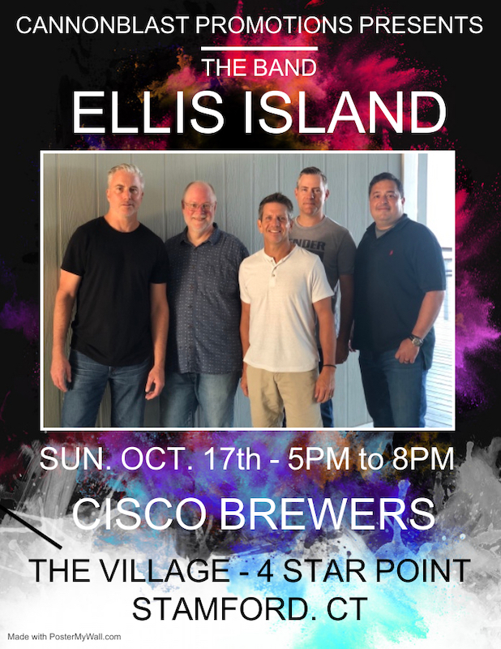

### September 2021

* **September 18th** &ndash; *Private Event*

### August 2021

* **August 5th** &ndash; *Private Event*

### July 2021

* **July 18th** &ndash; Ellis Island Acoustic (Tim and Jim) are at a private
  party.

### June 2021

* **June 13th** &ndash; Ellis Island Acoustic (Tim and Jim) are at a private
  party.

* **June 18th** &ndash; Steelpointe International Boat Show at the
  Bridgeport Harbor Marina, 3:00-4:30. The good news: there are a ton of
  great bands playing. The bad news: it's invitation only.

### June 2020

* **June 4th** &ndash; Ellis Island Acoustic (Tim and Jim) are at the
  Westport Church Preschool fundraiser.

### November 2020

* **November 7th** &ndash; *Private Event* (outdoors, of course!)

### October 2020

* **October 18th** &ndash; Ellis Island Acoustic (Tim and Jim) are at the
  *Clubhouse Grille*, Oak Hills Golf Course, Norwalk CT. Open to the public.

### September 2020

* **September 5th** &ndash; *Clubhouse Grille*, 165 Fillow St, Norwalk CT.
  Open to the public. Sit outside, enjoy great food and drink, and listen to
  the Ellis Island Duo: Tim and Jim.

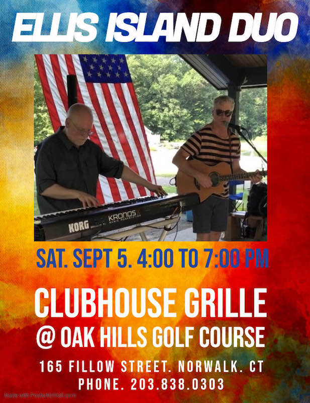

### February 2020

* **February 21st** &ndash; Warde High School basketball team fundraiser
  *Grace O'Malley's*, 1494 Post Rd, Fairfield CT. $10 at the door. A singer
  will be performing from 7-9, then we'll go on at 9:30 and add that magical
  rock touch that we do so well.

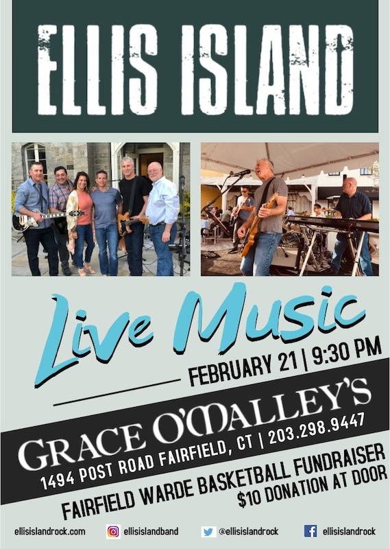

* **February 29th** &ndash; *Rach's Hope PJ Gala 2020*, Penfield Pavilion,
  Fairfield, CT.
  [Rach's Hope: Weathering The Storm Of Critical Illness](https://06880danwoog.com/2019/02/18/rachs-hope-weathering-the-storm-of-critical-illness)
  has more information about Rachel and the foundation that's been created
  in her honor. See [this page](https://e.givesmart.com/events/foC/) for
  tickets and more event information. We played last year and had a blast.
  Food, auctions, and music galore.

### December 2019

* **December 1st** &ndash; *Sherman Green Gazebo*, Fairfield CT.
  5:15pm-6:15pm. Join Ellis Island as we kick off the lighting of the town
  Christmas tree with an hour of your favorites. We'll even throw in a
  Christmas song!

* **December 14th** &ndash; *Private Event*

### October 2019

* **October 13th** &ndash; *Taste of Fairfield*, Delmar Southport, 275 Old
  Post Road, Southport CT

* **October 19th** &ndash; *Kieran's Place*, H. Smith Richardson Golf
  Course, 2425 Morehouse Highway, Fairfield CT. 8:00 PM.

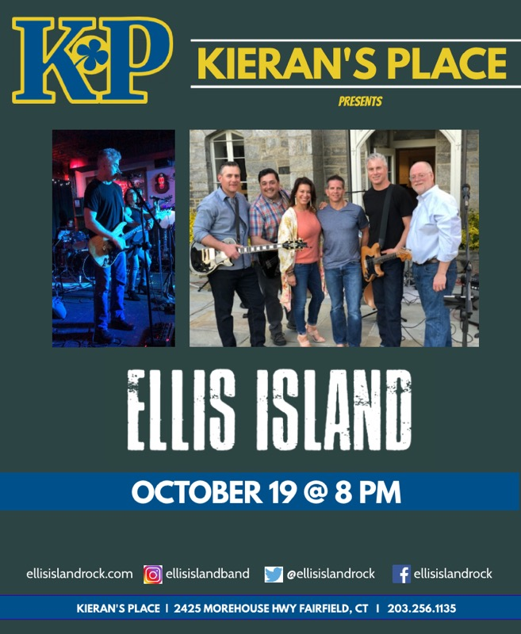

### September 2019

* **September 27th** &ndash; *Grace O'Malley's*, 1494 Post Rd, Fairfield CT

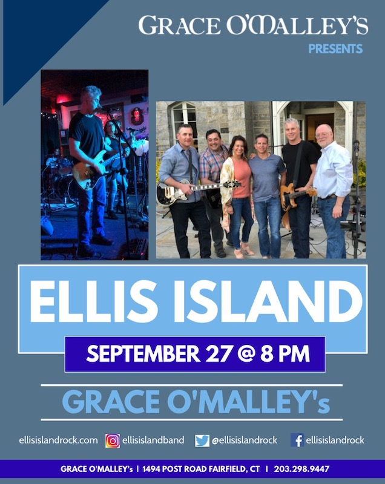

### August 2019

* **August 8th** &ndash; *Private Event*

### July 2019

* **July 20th** &ndash; Ellis Island Acoustic (Tim and Jim), *Private Event*

* **July 25th** &ndash; Ellis Island Acoustic (Tim and Jim), *Private Event*

### June 2019

* **June 14th** &ndash; Ellis Island Acoustic at *Saugatuck Sweets*, 575
  Riverside Ave, Westport, CT. 6:30-8 PM. Join us on the patio outside for
  killer ice cream and music!

* **June 15th** &ndash; The whole band will be rocking *Kieran's Place*, H.
  Smith Richardson Golf Course, 2425 Morehouse Highway, Fairfield CT. 8:00
  PM. Open to the public.

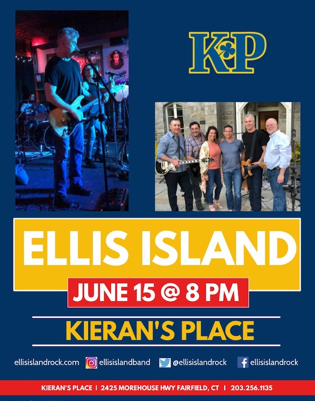

### May 2019

* **May 18th** &ndash; *Private Event*

### April 2019

* **April 5th** &ndash; Ellis Island Acoustic (Tim and Jim) were at the *St.
  Lawrence Society*.

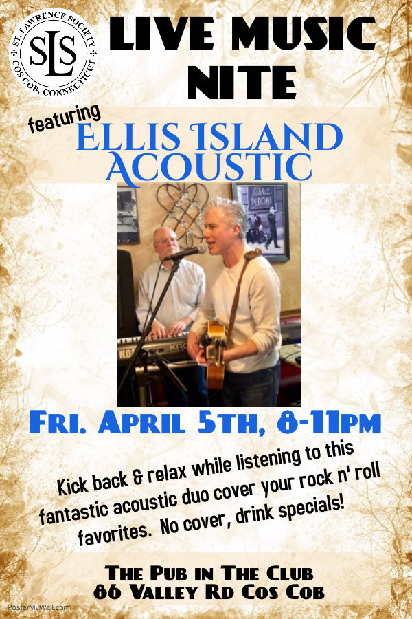

* **April 24th** &ndash; Ellis Island Acoustic (Tim, Nate, Alex, and Jim)
  played at the *Hi-Ho Motel* for a Mad Men-themed party! 4180 Black Rock
  Turnpike, Fairfield, CT

### March 2019

* **March 30th** &ndash; *Gridiron Club*, a fundraiser for the Farfield
  Warde High School football team.

* **March 14th** &ndash; Ellis Island Acoustic (Tim and Jim) at *Pomodoro
  Restaurant*, 1247 E. Putnam Ave, Riverside CT

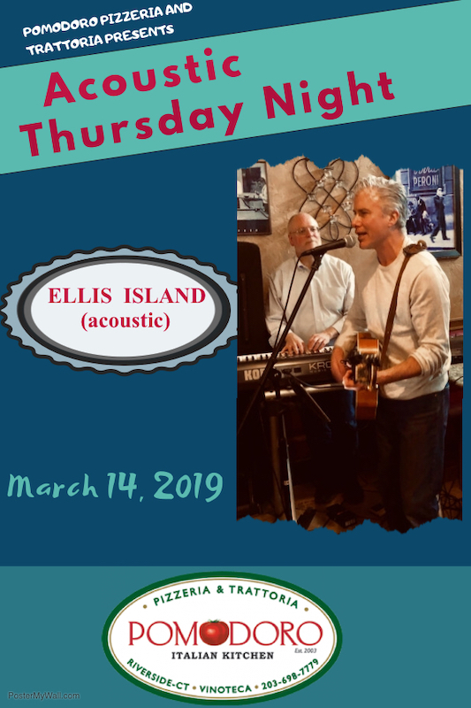

* **March 2nd** &ndash; *Rach's Hope*, Penfield Pavilion, Fairfield, CT
  [Rach's Hope Kickoff!](https://www.eventbrite.com/e/rachs-hope-kickoff-tickets-55122699478?ref=eios&aff=eios)
  Families helping families weather the storm of critical illness.
  [Rach’s Hope: Weathering The Storm Of Critical Illness](https://06880danwoog.com/2019/02/18/rachs-hope-weathering-the-storm-of-critical-illness)
  has more information about Rachel and the foundation that's been created
  in her honor.

### February 2019

* **Feb 14th** &ndash; *Pomodoro Restaurant*, 1247 E. Putnam Ave, Riverside
  CT

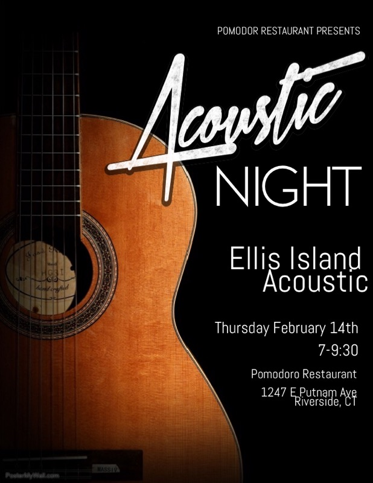

* **Feb 1st** &ndash; *Grace O'Malley's*, 1494 Post Rd, Fairfield CT

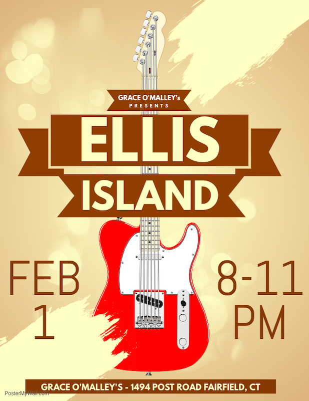

### January 2019

* **Jan 4th** &ndash; *The Seagrape*, 1144 Reef Road, Fairfield CT

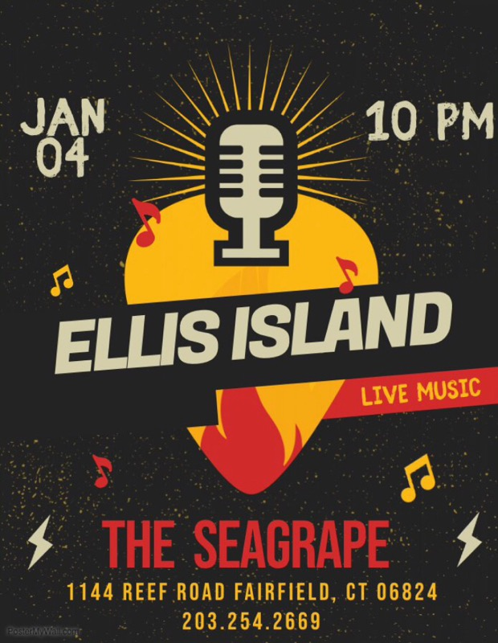

### December 2018

* **Dec 7th** &ndash; *Private Event*

### November 2018

* **Nov 8th** &ndash; *Grace O'Malley's*, 1494 Post Rd, Fairfield CT

### The Distant Past

Alas, no records remain of a time so ancient that the website did not even
exist.
