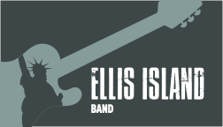
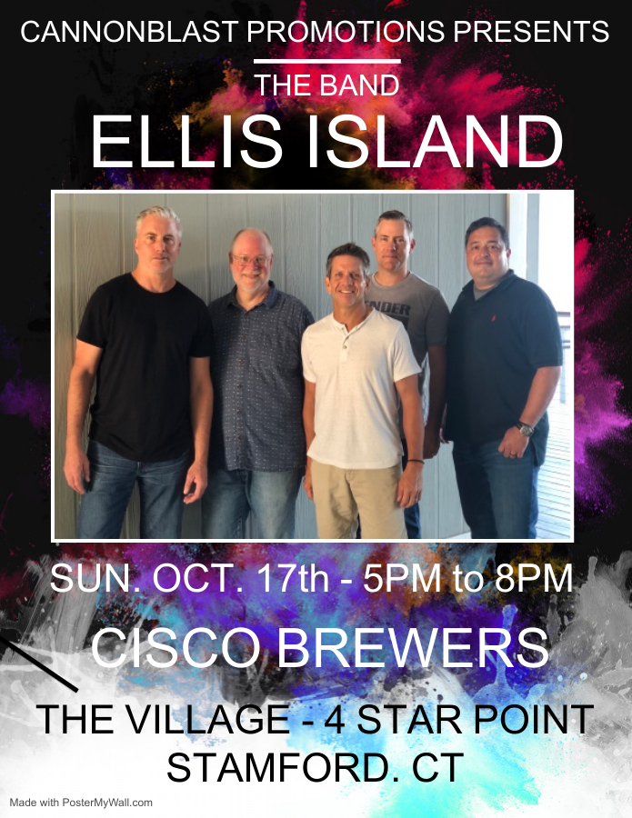

# Schedule

  &times;
  
  

<table>
  <tr>
    <td style="padding-right: 3em;">
      <i>We are in the process of booking more gigs in the coming months.
      This page will always have the latest info on confirmed dates. Stay tuned.</i>
    </td>
    <td width="300">
      
    </td>
  </tr>
</table>

## Upcoming

* **March 11th, 2022** &ndash; *The Shebeen of Black Rock*, 2652 Fairfield
  Ave, Bridgeport, CT. 8:00 PM --- an early start!

* **May 7th, 2022** &ndash; Ellis Island Acoustic (Tim and Jim) will be at
  the *Rach's Hope PJ Gala 2022*, Penfield Pavilion, Fairfield, CT from
  7:30 - 11:00. This is a charity event with food, auctions, and music. For
  more info see [Rach's Hope](https://www.rachshope.org/).

* **May 21st, 2022** &ndash; *Brooklawn Country Club*'s "Kick Off for
  Summer" party. 500 Algonquin Rd, Fairfield, CT.

* **August 20th, 2022** &ndash; *Fairfield Sherman Green* (the Gazebo),
  6:30. Corner of Post Road (Route 1) and Reef Road.

* **September 10th, 2022** &ndash; Look for Ellis Island at Stratford's
  LincolnParkPalooza!

* **September 15th, 2022** &ndash; *Halloween Yacht Club* (10 Seaview Ave,
  Stamford) has bands outside all summer long on Thursday nights. See you on
  there on the 15th, 6:30 - 9:30.

## Past Gigs

### December 2021

* **December 4th** &ndash; *Private Event* for the Stratford Village
  Association at The Discovery Museum in Bridgeport, CT.

* **December 10th** &ndash; Ellis Island Acoustic (Tim and Jim) are at the
  *Stamford Yacht Club*, 97 Ocean Dr W, Stamford, CT from 5:30 - 8:30. We'll
  be playing a mix of Christmas songs and our usual repertoire.

* **December 17th** &ndash; *The Shebeen of Black Rock*, 2652 Fairfield Ave,
  Bridgeport, CT. 8:30 PM.

### October 2021

* **October 2nd** &ndash; Ellis Island Acoustic (Tim and Jim) are at *Rach's
  Hope "Walk the Extra Mile with Pa!"* at 4pm at the Ned Dimes Marina
  boathouse at Compo Beach in Westport, CT. See
  [https://rhwalk.givesmart.com](https://rhwalk.givesmart.com) for more
  info.

* **October 7th** &ndash; *Private Event* Ellis Island Acoustic (Tim and
  Jim) are at the Halloween Yacht Club in Stamford, CT from 7pm-10pm.

* **October 17th** &ndash; 5:00 - 8:00 at Cisco Brewers at The Village, 4
  Star Point in Stamford.

### September 2021

* **September 18th** &ndash; *Private Event*

### August 2021

* **August 5th** &ndash; *Private Event*

### July 2021

* **July 18th** &ndash; Ellis Island Acoustic (Tim and Jim) are at a private
  party.

### June 2021

* **June 13th** &ndash; Ellis Island Acoustic (Tim and Jim) are at a private
  party.

* **June 18th** &ndash; Steelpointe International Boat Show at the
  Bridgeport Harbor Marina, 3:00-4:30. The good news: there are a ton of
  great bands playing. The bad news: it's invitation only.

### June 2020

* **June 4th** &ndash; Ellis Island Acoustic (Tim and Jim) are at the
  Westport Church Preschool fundraiser.

### November 2020

* **November 7th** &ndash; *Private Event* (outdoors, of course!)

### October 2020

* **October 18th** &ndash; Ellis Island Acoustic (Tim and Jim) are at the
  *Clubhouse Grille*, Oak Hills Golf Course, Norwalk CT. Open to the public.

### September 2020

* **September 5th** &ndash; *Clubhouse Grille*, 165 Fillow St, Norwalk CT.
  Open to the public. Sit outside, enjoy great food and drink, and listen to
  the Ellis Island Duo: Tim and Jim.

### February 2020

* **February 21st** &ndash; Warde High School basketball team fundraiser
  *Grace O'Malley's*, 1494 Post Rd, Fairfield CT. $10 at the door. A singer
  will be performing from 7-9, then we'll go on at 9:30 and add that magical
  rock touch that we do so well.

* **February 29th** &ndash; *Rach's Hope PJ Gala 2020*, Penfield Pavilion,
  Fairfield, CT.
  [Rach's Hope: Weathering The Storm Of Critical Illness](https://06880danwoog.com/2019/02/18/rachs-hope-weathering-the-storm-of-critical-illness)
  has more information about Rachel and the foundation that's been created
  in her honor. See [this page](https://e.givesmart.com/events/foC/) for
  tickets and more event information. We played last year and had a blast.
  Food, auctions, and music galore.

### December 2019

* **December 1st** &ndash; *Sherman Green Gazebo*, Fairfield CT.
  5:15pm-6:15pm. Join Ellis Island as we kick off the lighting of the town
  Christmas tree with an hour of your favorites. We'll even throw in a
  Christmas song!

* **December 14th** &ndash; *Private Event*

### October 2019

* **October 13th** &ndash; *Taste of Fairfield*, Delmar Southport, 275 Old
  Post Road, Southport CT

* **October 19th** &ndash; *Kieran's Place*, H. Smith Richardson Golf
  Course, 2425 Morehouse Highway, Fairfield CT. 8:00 PM.

### September 2019

* **September 27th** &ndash; *Grace O'Malley's*, 1494 Post Rd, Fairfield CT

### August 2019

* **August 8th** &ndash; *Private Event*

### July 2019

* **July 20th** &ndash; Ellis Island Acoustic (Tim and Jim), *Private Event*

* **July 25th** &ndash; Ellis Island Acoustic (Tim and Jim), *Private Event*

### June 2019

* **June 14th** &ndash; Ellis Island Acoustic at *Saugatuck Sweets*, 575
  Riverside Ave, Westport, CT. 6:30-8 PM. Join us on the patio outside for
  killer ice cream and music!

* **June 15th** &ndash; The whole band will be rocking *Kieran's Place*, H.
  Smith Richardson Golf Course, 2425 Morehouse Highway, Fairfield CT. 8:00
  PM. Open to the public.

### May 2019

* **May 18th** &ndash; *Private Event*

### April 2019

* **April 5th** &ndash; Ellis Island Acoustic (Tim and Jim) were at the *St.
  Lawrence Society*.

* **April 24th** &ndash; Ellis Island Acoustic (Tim, Nate, Alex, and Jim)
  played at the *Hi-Ho Motel* for a Mad Men-themed party! 4180 Black Rock
  Turnpike, Fairfield, CT

### March 2019

* **March 30th** &ndash; *Gridiron Club*, a fundraiser for the Farfield
  Warde High School football team.

* **March 14th** &ndash; Ellis Island Acoustic (Tim and Jim) at *Pomodoro
  Restaurant*, 1247 E. Putnam Ave, Riverside CT

* **March 2nd** &ndash; *Rach's Hope*, Penfield Pavilion, Fairfield, CT
  [Rach's Hope Kickoff!](https://www.eventbrite.com/e/rachs-hope-kickoff-tickets-55122699478?ref=eios&aff=eios)
  Families helping families weather the storm of critical illness.
  [Rach’s Hope: Weathering The Storm Of Critical Illness](https://06880danwoog.com/2019/02/18/rachs-hope-weathering-the-storm-of-critical-illness)
  has more information about Rachel and the foundation that's been created
  in her honor.

### February 2019

* **Feb 14th** &ndash; *Pomodoro Restaurant*, 1247 E. Putnam Ave, Riverside
  CT

* **Feb 1st** &ndash; *Grace O'Malley's*, 1494 Post Rd, Fairfield CT

### January 2019

* **Jan 4th** &ndash; *The Seagrape*, 1144 Reef Road, Fairfield CT

### December 2018

* **Dec 7th** &ndash; *Private Event*

### November 2018

* **Nov 8th** &ndash; *Grace O'Malley's*, 1494 Post Rd, Fairfield CT

### The Distant Past

Alas, no records remain of a time so ancient that the website did not even
exist.
