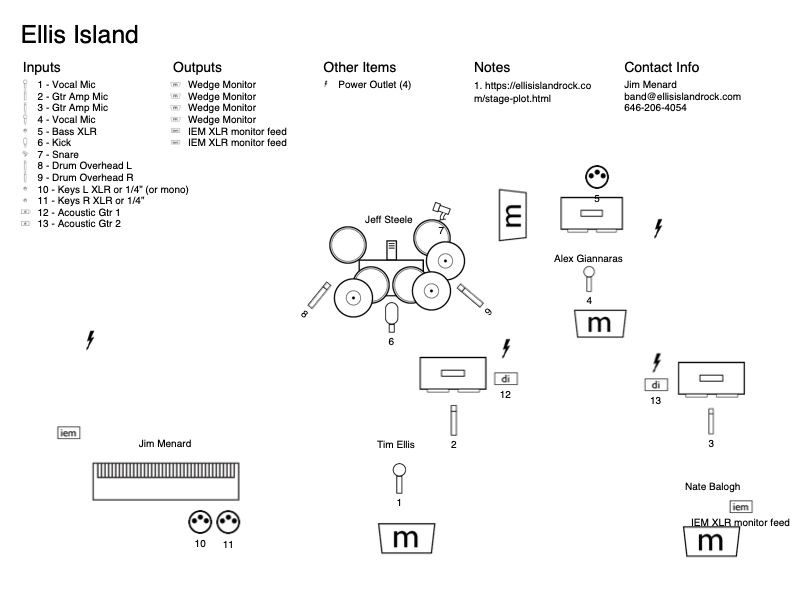

# Stage Plot

Ellis Island is a five piece rock band: guitar + lead vocals, guitar, bass +
vocals, drums, and keyboards. Lead front and center, 2nd guitar and bass
stage right, keys stage left, drums upstage center.

- 2 vocal mics
  - Center stage for lead vocals
  - Stage right in front of bass amp for bass player
- 2 mics for guitar amps
- Mono XLR direct out for bass amp
- Stereo XLR out for keys (keys go into a submixer with stereo XLR out)
- Drum mics (your discretion: kick with front port and blanket inside,
  snare, HH, 3 toms, 2 rotos, multiple cymbals)
- 2 DIs for acoustic guitars (won't always need both for every gig)
- 5 monitors, one for each band member:
  - 2 in front (center and stage right)
  - 1 for bass
  - 1 for drums
  - 1 for keys
- AC: at least four 110V/120V outlets

You can contact us at the email address below.

