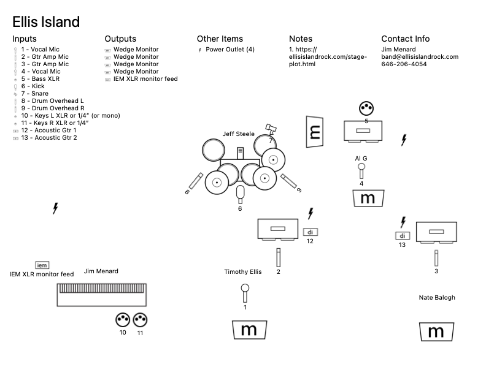

# Stage Plot

Ellis Island is a five piece rock band: guitar + lead vocals, guitar, bass +
vocals, drums, and keyboards. Lead front and center, 2nd guitar and bass
stage right, keys stage left, drums upstage center.

- 2 vocal mics in front (center and stage right)
- 2 mics for guitar amps
- Mono XLR direct out for bass amp
- 2 DIs for acoustic guitars (won't always need both for every gig)
- Drum mics (your discretion: kick with front port and blanket inside,
  snare, HH, 3 toms, 2 rotos, multiple cymbals)
- Keys: stereo XLR out to house. Keys have an on-stage submixer and take
  care of the balance among the keys. FoH gets a single stereo mix.
- Vocal/instrument monitors:
  - 2 monitors in front (center and stage right)
  - 1 monitor for drummer
  - 1 monitor for keys
- AC: at least four 110V/120V outlets

You can contact us at the email address below.

